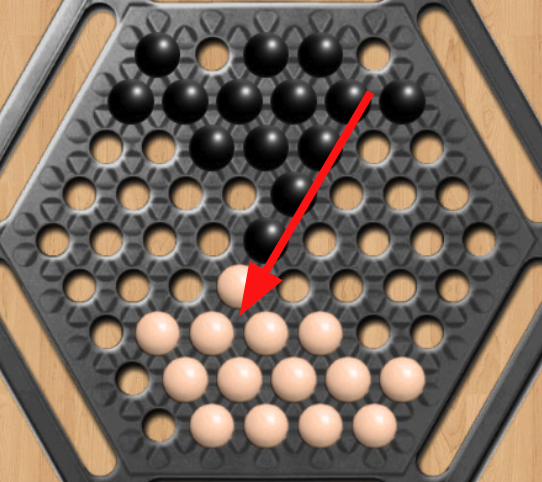
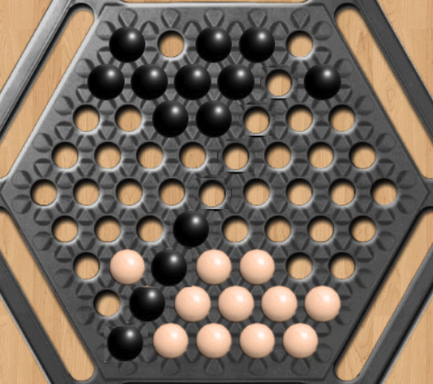

## Ultimate Abalone with Minimax
### Introduction

This repository presents an innovative version of the classic board game Abalone, which was first created in 1987. It begins with an overview of the conventional gameplay where two players aim to push their opponent's marbles off a hexagonal board. The enhancement, termed "Ultimate Abalone," incorporates more complex strategies by permitting players to push any number of their opponent's marbles with no more than five of their own marbles. Additionally, this version introduces aggressive tactics that allow marbles to be pushed directly off the board in a single move. The article also explores the technical dimensions, detailing the data structure of the game board and the logic behind marble movements within a programming framework, showcasing how these features contribute to a deeper strategic experience. An AI player utilizing the minimax algorithm has also been developed to enhance gameplay.

---
### The Typical Game of Abalone 
Abalone is a strategic board game designed for two players. It was invented in 1987 by Michel Lalet and Laurent Lévi, and has since captivated players around the world. The game’s objective is to push six of the opponent's marbles off the edge of the hexagon-shaped board.

#### Board and Setup
The board consists of 61 circular spaces where marbles can reside. Each player starts with 14 marbles positioned on opposite sides of the board.

#### Moves
Players alternate turns, moving their marbles in one of six directions. Moves can be made in-line (pushing) or broadside (side-stepping).
* In-line Move: Marbles are moved as a column into a free space
  * 3 marbles push 1 marble
  * 3 marbles push 2 marbles
  * 2 marbles push 1 marble
* Side Step: Marbles are moved sideways into adjacent free spaces
  
#### Reference
[Wikipedia](https://en.wikipedia.org/wiki/Abalone_(board_game))

---

### Ultimate Abalone - Enhanced Strategy
* Enhanced Move Mechanics: In the Ultimate Abalone, the classic move limitations are expanded. Players can now push any number of marbles (N) with a greater number of their own (M), given N>M and M<=5, making the game more dynamic and strategic.
* Offensive Moves: Ultimate Abalone proposes offensive strategy by permitting players to push the opponent's marbles directly off the board in a single action. This rule applies even if the opponent's marbles are not positioned adjacent to the board's edge at the start of the turn. To achieve such a bold push, there must be a direct, unobstructed line between the opponent's marbles and the board's edge. These newly introduced high-stakes plays amplify the intensity of each move, compelling players to engage with foresight and boldness as they orchestrate their path to victory.

| Before                                            | After                                             |
| :---:                                             | :---:                                             |
|  |  |


---

### Data Structure of Game Board

```
            self.board = np.array([
            [-2, -2, -2, -2, -2, -2, -2, -2, -2, -2, -2],
            [-2, -2, -2, -2, -2,  1,  1,  1,  1,  1, -2],
            [-2, -2, -2, -2,  1,  1,  1,  1,  1,  1, -2],
            [-2, -2, -2, -1, -1,  1,  1,  1, -1, -1, -2],
            [-2, -2, -1, -1, -1, -1, -1, -1, -1, -1, -2],
            [-2, -1, -1, -1, -1, -1, -1, -1, -1, -1, -2],
            [-2, -1, -1, -1, -1, -1, -1, -1, -1, -2, -2],
            [-2, -1, -1,  0,  0,  0, -1, -1, -2, -2, -2],
            [-2,  0,  0,  0,  0,  0,  0, -2, -2, -2, -2],
            [-2,  0,  0,  0,  0,  0, -2, -2, -2, -2, -2],
            [-2, -2, -2, -2, -2, -2, -2, -2, -2, -2, -2]
         ])
```
The code above refers to the hexagonal board below. In this code, 1 represents white marbles, while 0 represents black marbles. -1 represents a blank space on the board, while -2 represents a position outside of the board. 

```
                      W W W W W 
                     W W W W W W 
                    . . W W W . . 
                   . . . . . . . . 
                  . . . . . . . . . 
                   . . . . . . . . 
                    . . B B B . . 
                     B B B B B B 
                      B B B B B
```

The code below illustrates the correspondence between directions on a hexagonal board and their equivalents in a 2D array. The keys of the dictionary represent the directions on the hexagonal board, while the values indicate the corresponding directions in the 2D array.

```
            DIRECTIONS = {
                    'LEFT': (0, -1),
                    'RIGHT': (0, 1),
                    'UP_LEFT': (-1, 0),
                    'UP_RIGHT': (-1, 1),
                    'DOWN_LEFT': (1, -1),
                    'DOWN_RIGHT': (1, 0)
                }
```

---

### AI Player Development Using Minimax Algorithm

#### Overview of Minimax
The Minimax algorithm is a decision-making AI model used widely in two-player games. This algorithm plays a crucial role in the development of the AI player for Ultimate Abalone, enabling it to consider both its moves and the potential responses of the opponent. Minimax helps in evaluating the best move from the current game state by minimizing the possible loss for a worst-case scenario maximum loss.

#### Implementation in Ultimate Abalone
In Ultimate Abalone, the Minimax algorithm has been tailored to handle the enhanced game mechanics, allowing the AI to plan moves that can push multiple marbles and execute offensive strategies effectively. The depth of the Minimax tree varies based on the complexity of the game state, with deeper levels representing more advanced future game states.

**Enhanced Heuristic Function:**
- **Positional Value**: The AI evaluates positions not just based on the number of opponent marbles that can be pushed out but also on the strategic positioning of its own marbles. This includes forming configurations that prevent the opponent from making significant moves.
- **Marble Advantage**: Prioritizes moves that maximize the differential in the number of marbles between the player and the opponent, pushing towards a state where the opponent has fewer options for movement.

**Adaptive Depth Levels:**
- The AI uses adaptive depth levels in the Minimax algorithm to optimize performance and response time. During critical stages of the game or when fewer marbles are on the board, the AI explores deeper into the game tree.

**Pruning Techniques:**
- Alpha-beta pruning is integrated into the algorithm to reduce the number of nodes evaluated, enhancing the decision-making speed without sacrificing accuracy. This technique skips evaluating branches in the Minimax tree that won't affect the final decision.

---

### Project Structure

This project consists of several Python files, each serving a specific function in the implementation of the Ultimate Abalone game. Below, you will find an overview of each component.

#### Components Overview

1. **game_board.py**
   - **Purpose**: Defines the `GameBoard` class, which handles the game's board setup, game state management (like updating counts of marbles pushed out), and utility functions for game mechanics.
   - **Key Features**:
     - Board initialization and configuration.
     - Functions to evaluate board states for AI decision-making.
     - Utilities for checking game completion and updating marble counts.

2. **player.py**
   - **Purpose**: Implements the `Player` class responsible for managing the player's actions, including decision-making via Minimax algorithm and random moves.
   - **Key Features**:
     - Functions to determine and execute moves based on the strategy (Minimax or random).
     - Heuristic evaluation integration for AI strategy enhancement.

3. **move.py**
   - **Purpose**: Contains the `Move` class that defines the logic to validate and execute moves on the game board.
   - **Key Features**:
     - Move validation and execution based on game rules.
     - Handling of in-line and side-step moves according to the game's strategy.

4. **gameplay.py**
   - **Purpose**: Serves as the main script to run simulations using basic player strategies without heuristic variations.
   - **Key Features**:
     - Game loop to manage turn-taking and determine game outcomes.
     - Interaction with the `GameBoard` and `Player` classes to simulate the game.

5. **gameplay_different_heuristic.py**
   - **Purpose**: An extension of the gameplay to allow comparison between different heuristic functions.
   - **Key Features**:
     - Enables users to select different heuristic strategies for the AI players, facilitating comparisons of AI performance.

---


### Code Analysis

#### Move (move.py)
The code for moving marbles checks the next few marble positions to determine if they are empty or occupied by opponents' marbles. If there are fewer opponent marbles, it then evaluates the likelihood of offensive play success by examining subsequent positions. The computation is completed in constant time, denoted as O(1), Θ(1), and Ω(1).

---

### Slides
[Slide link]()

---

### Work Allocation
* Spencer: Brainstorm the concept for Ultimate Abalones and focus on programming the move.py, the key functionality for executing the game.
